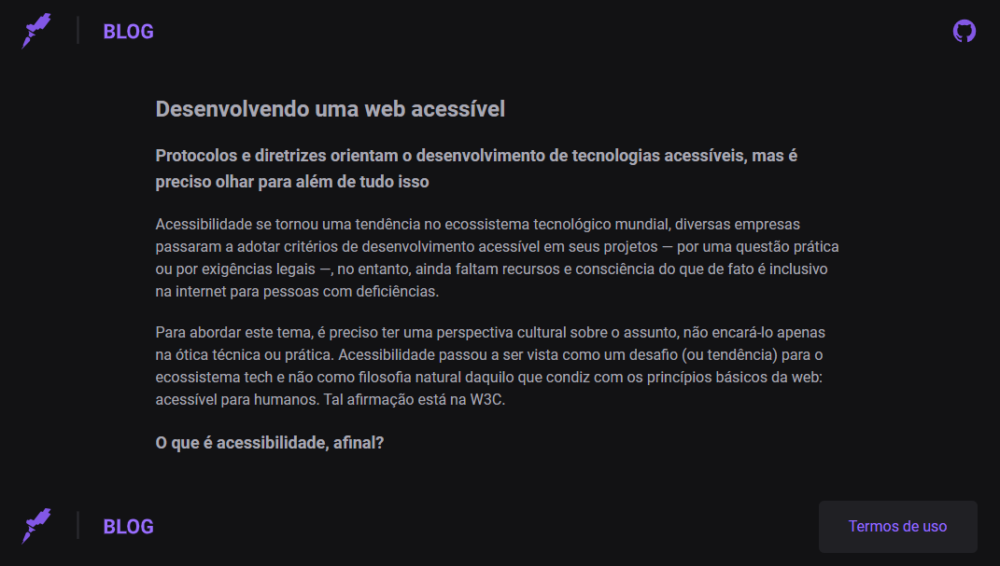
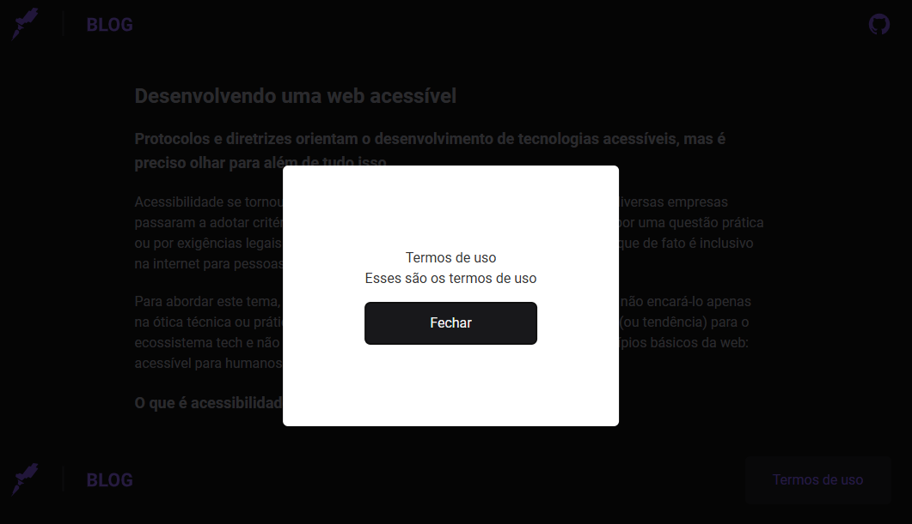

# Curso Acessibilidade Rocketseat

## Conteúdo

- Fundamentos da acessibilidade (Web, ARIA, Guidelines)
- Projeto prático de acessibilidade (setup do projeto, estruturação da página, testes, contraste, etc.)
- Leitores de tela (como funcionam, bibliotecas recomendadas e aplicação na prática).

-------------------------------------------

-------------------------------------------

